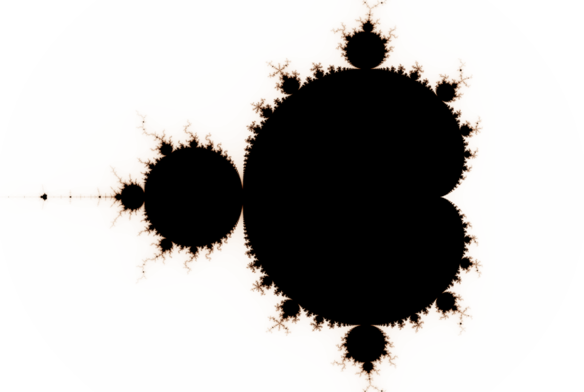
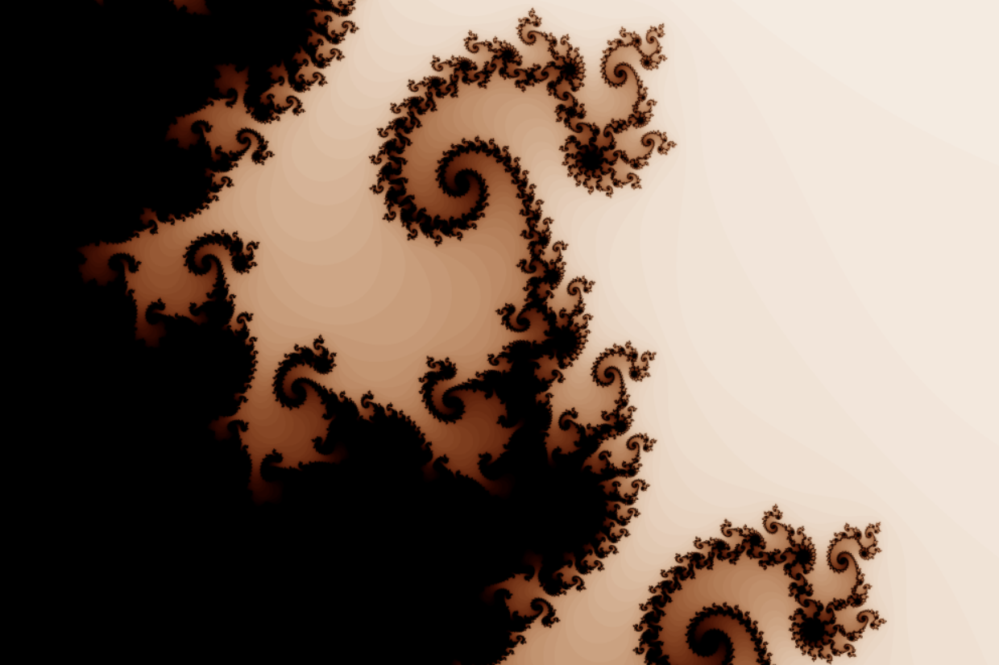
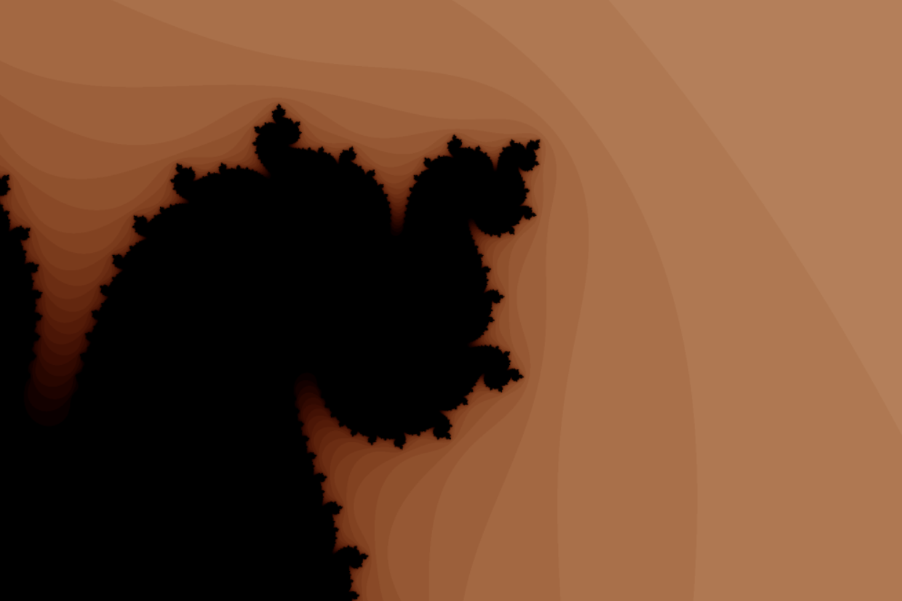

# Visualisation de l'ensemble de Mandelbrot (Décembre 2024)  

Le projet permet des zooms infinis, et un lissage de la palette de couleurs, mais les calculs sont très très lents (ce serait mieux dans un autre langage que Python)  

# Examples  

  
  
  
