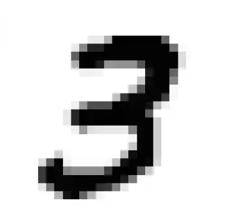

# Mon premier projet d'implémentation de réseau de neurones à partir d'uniquement numpy  (Avril 2024)  

Projet effectué juste après avoir eu le cours sur les fonctions à plusieurs variables en prépa parce que je comprenais pas la backpropagation avant.  
J'utilise ensuite le modèle pour le tester sur des lettres dessinées à la main et je fais de l'augmentation de données sur MNIST.  
Le code n'est pas optimisé et ressemble beaucoup à du bricolage.  

  