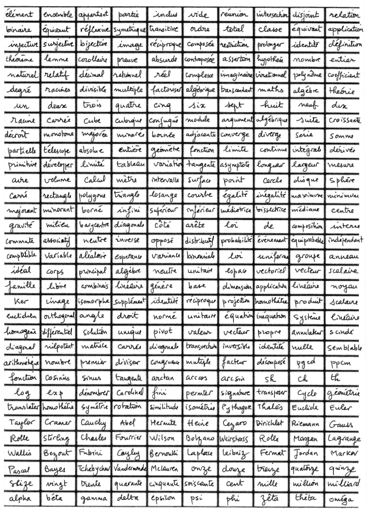

# TIPE, projet de fin de classe prépa  

Projet de Computer Vision (uniquement des MLP) pour distinguer les écritures d'élèves de ma classe, ayant chacun rempli une feuille où ils écrivent 330 mots pour entraîner et tester le modèle.  

  